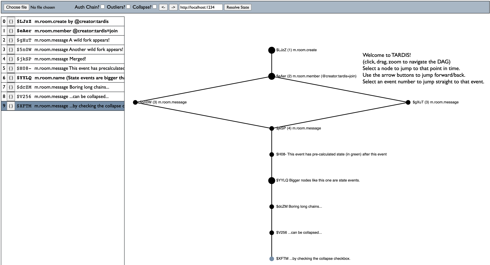

## TARDIS - Time Agnostic Room DAG Inspection Service

TARDIS is a time-travelling debugger for Matrix room DAGs, which reads a plaintext file
to graphically visualise a room using [d3-dag](https://github.com/erikbrinkman/d3-dag) for
debugging purposes. It can then perform state resolution at any given event on the DAG via
a shim server. TARDIS comes with a Synapse shim server, which needs to be run in addition
to TARDIS. See `shims/synapse`.

## Generates stuff like this:



### To use:

Requires node 20+ for global crypto variables.
```
yarn install
yarn run start
```
or:
```
docker build -t tardis .
docker run --rm -p 5173:5173 tardis
```

## Loading events

### ..via existing events in a database
Provide a new-line delimited JSON file which contains events to render in the full federation format (with `prev_events`, etc).
To get such a file _for Synapse installations on Postgres_, run the following (assuming `matrix` is the name of your DB):
```
$ psql matrix
matrix=> \t
Tuples only is on.
matrix=> \o the-file.ndjson
matrix=> select jsonb_insert(json::JSONB, '{event_id}', ('"' || event_id || '"')::JSONB) from event_json where event_id in 
    (select event_id from events where
        room_id='!THE_ROOM_ID' and
        stream_ordering < (select stream_ordering from events where event_id='$LATEST_EVENT_ID') and 
        stream_ordering > (select stream_ordering from events where event_id='$EARLIEST_EVENT_ID')
        order by stream_ordering asc
    );
```
You can drop the `stream_ordering` clauses if the room is small and you want to see the entire thing.

It is important that the events are sorted in causal order. To do this with [jq](https://jqlang.github.io/jq/): just do:
```
cat the-file.ndjson | jq -s 'sort_by(.depth)' > sorted-file.ndjson
```
The file created by these commands can be dropped **as-is** into TARDIS.

### ..via scenario JSON5 files
Provide a JSON5 file which contains the scenario to run. See the `examples` directory for examples on
the keys available.

## Developing


### Building WASM
Sometimes we want to create mock scenarios which don't exist in databases. We use placeholder event IDs in this case. However, state
resolution demands that they are actual event IDs. Tardis uses the same code paths as Dendrite (via wasm) to generate the correct event IDs.
To build the wasm, you need [tinygo](https://tinygo.org/) installed and then:
```
GOOS=js GOARCH=wasm tinygo build -o ./public/gmsl.wasm --no-debug ./cmd/wasm/main.go
```
A working version is already supplied with this repository.
