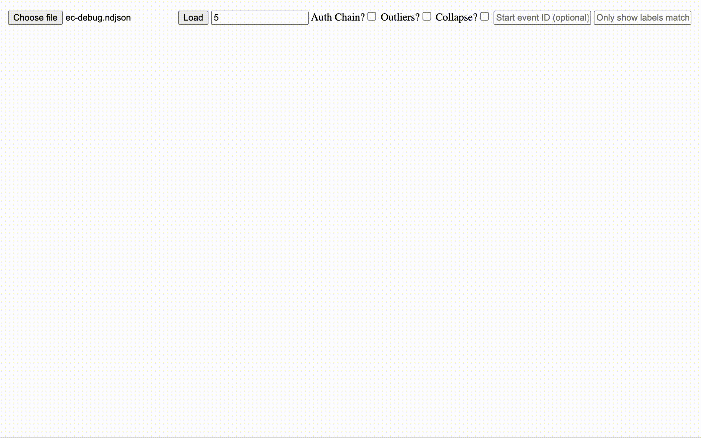

## TARDIS - Time Agnostic Room DAG Inspection Service

TARDIS is a time-travelling debugger for Matrix room DAGs, which reads a plaintext file
to graphically visualise a room using [d3-dag](https://github.com/erikbrinkman/d3-dag) for
debugging purposes.

The original intention was to add it as a RightPanel widget to Element (particularly in p2p mode)
to help figure out what's gone wrong if your P2P node goes weird. The current intention is
to use it to explore the shape of public room DAGs to design better APIs for P2P federation.

It's effectively the real-life version of the 2014-vintage D3 "how matrix
works" animation from the frontpage of Matrix.org.

Currently very experimental and PoC.

## Generates stuff like this:



### To use:

```
yarn install
yarn run start
```

Then provide a new-line delimited JSON file which contains events to render in the full federation format (with `prev_events`, etc).
To get such a file _for Synapse installations on Postgres_, run the following (assuming `matrix` is the name of your DB):
```
$ psql matrix
matrix=> \t
Tuples only is on.
matrix=> \o the-file.ndjson
matrix=> select jsonb_insert(json::JSONB, '{event_id}', ('"' || event_id || '"')::JSONB) from event_json where event_id in 
    (select event_id from events where
        room_id='!THE_ROOM_ID' and
        stream_ordering < (select stream_ordering from events where event_id='$LATEST_EVENT_ID') and 
        stream_ordering > (select stream_ordering from events where event_id='$EARLIEST_EVENT_ID')
        order by stream_ordering asc
    );
```
You can drop the `stream_ordering` clauses if the room is small and you want to see the entire thing. The file created by these
commands can be dropped **as-is** into TARDIS.
